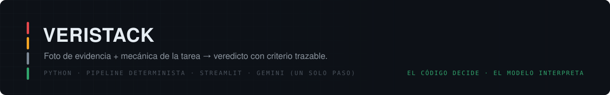
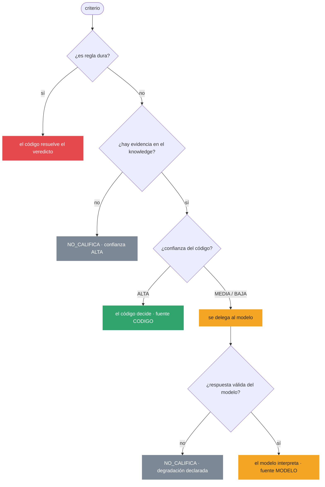
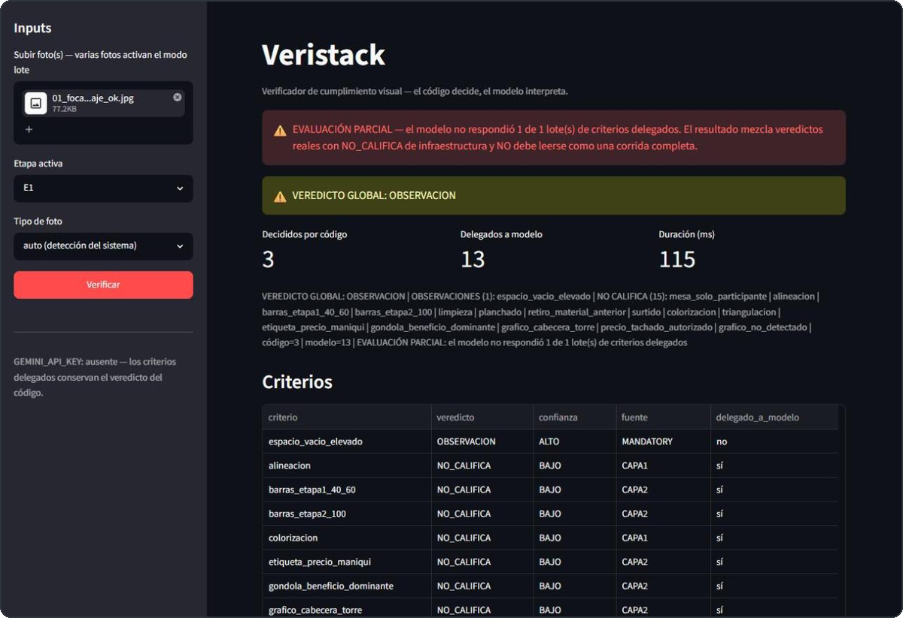
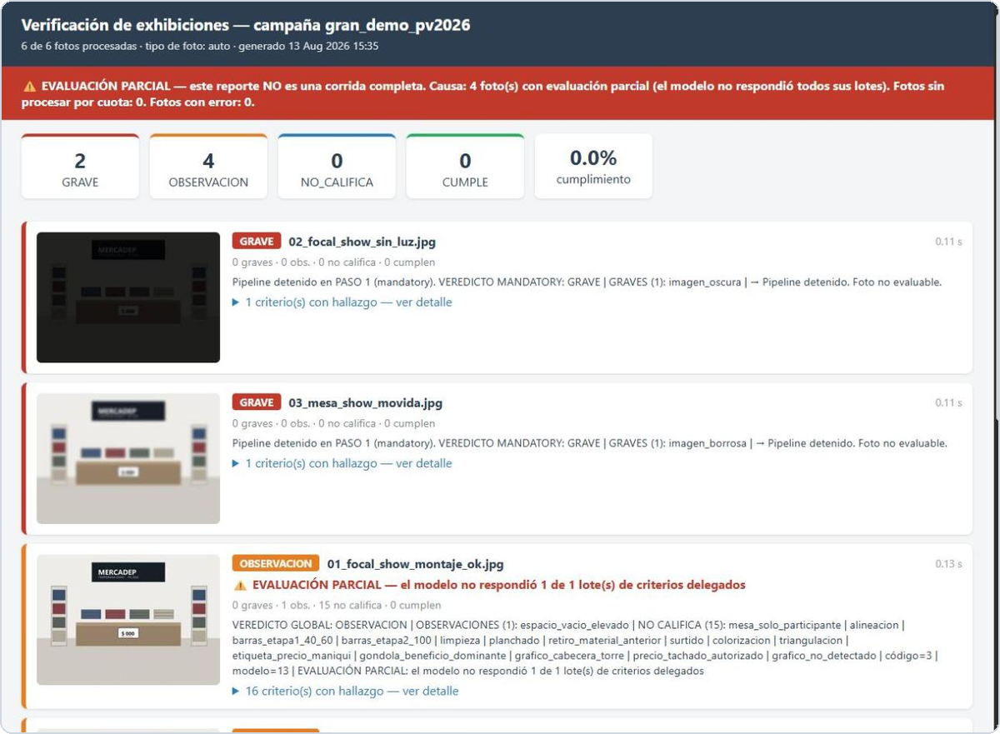

<p align="center">
  
  
  
  
  
</p>

**Motor de verificación de cumplimiento visual para retail.** Recibe una foto de evidencia
y la mecánica de la tarea, la contrasta contra el estándar operativo del cliente y emite
una calificación con criterio trazable.

> [!NOTE]
> La knowledge base incluida en este repo es **100% sintética** (cliente ficticio
> *Mercadep*). El sistema opera con el conocimiento privado de cada cliente bajo el mismo
> esquema. Ningún dato real de clientes vive en este repositorio ni en su historial.

---

## El principio: el código decide, el modelo interpreta

La mayoría de las herramientas de "IA para verificación" le entregan la foto al modelo y
le preguntan qué opina. Veristack hace lo contrario:

- **Las reglas duras las resuelve 100% el código** (`mandatory_engine`). El modelo no vota,
  no revisa, y no puede sobreescribir un GRAVE que el código ya determinó.
- **El modelo entra en un único paso del pipeline**, y solo sobre los criterios que el
  código marcó explícitamente como delegables (`delegar_a_modelo=True`).
- Cada resultado declara su origen: `fuente: CODIGO` o `fuente: MODELO`. La calificación es
  auditable línea por línea.

El resultado no es *"la IA detectó un problema"*, es:

```
imagen_oscura: GRAVE — brillo=31 (mínimo aceptable: 40) — fuente: CODIGO
```

## Arquitectura



**Knowledge en 3 capas por velocidad de caducidad:** capa 1 (básicos permanentes de
display), capa 2 (campaña activa, con vigencia), capa 3 (criterios por tipo de foto). Todo
JSON versionado por esquema.

## Cómo se decide un criterio

La parte que importa no es el camino feliz, es lo que pasa cuando falta información:



Nótese que **hay dos caminos distintos que terminan en `NO_CALIFICA`** y ninguno termina en
un `CUMPLE` inventado. Esa asimetría es la decisión de diseño central del sistema.

## Jerarquía de severidad

| | Veredicto | Significado |
|---|---|---|
| 🔴 | `GRAVE` | Impacto económico; puede bloquear la calificación |
| 🟠 | `OBSERVACION` | Falla de calidad sin impacto directo en dinero |
| ⚪ | `NO_CALIFICA` | Dato insuficiente — **se declara, no se adivina** |
| 🟢 | `CUMPLE` | Verificado y correcto |

La confianza (`ALTO`/`MEDIO`/`BAJO`) es un eje aparte y nunca se colapsa con la severidad.

## Honestidad como arquitectura

Las decisiones más importantes del sistema son sobre lo que **no** sabe:

- **Sin evidencia → `NO_CALIFICA`.** La regla 5 del confidence engine: si no hay criterio
  aplicable, el sistema lo dice con confianza ALTA — alta confianza en que no se puede
  saber. Nada de rellenar con juicio del modelo.
- **Respuesta malformada del modelo → degrada a `NO_CALIFICA`.** Basura del proveedor jamás
  se convierte en un CUMPLE fantasma.
- **Cuota agotada → circuit breaker + `evaluacion_parcial`.** El reporte declara qué
  porcentaje de criterios se degradó y por qué, en vez de fingir una corrida completa.
- **Knowledge corrupto → criterio visible `conocimiento_no_disponible`.** Una capa muerta
  nunca produce un CUMPLE con cero criterios.

Cada uno de estos casos tiene autotest propio. El stub del modelo permite correr la suite
completa sin gastar una sola llamada de API.

### Se ve así cuando pasa

Corrida real **sin `GEMINI_API_KEY`**: el sistema no rellena los huecos. Marca la corrida
como parcial, reporta lo que el código sí decidió y declara criterio por criterio lo que no
pudo verificar — con su fuente y si estaba delegado o no.

<p align="center">
  
</p>

## Modo lote

Una carpeta de fotos entra, sale un reporte HTML navegable + Excel. Cada foto con su
veredicto, sus hallazgos y su miniatura; arriba, el conteo por severidad y el porcentaje de
cumplimiento del lote.

<p align="center">
  
</p>

## Uso

```bash
pip install -r requirements.txt

# UI (una foto, o lote con multi-upload)
streamlit run app.py

# CLI de lote: carpeta de fotos → reporte HTML + Excel
python verificar_lote.py ./fotos --etapa gran_demo_pv2026 --tipo focal_show
```

Sin `GEMINI_API_KEY` en `.env`, el pipeline corre igual: todo lo que decide el código se
reporta, y lo delegable queda en `NO_CALIFICA` con su razón. Copia `.env.example` a `.env`
para configurar la tuya.

## Estructura

```
app.py                    UI Streamlit
verificar_lote.py         CLI modo lote
lote/                     runner + reporte HTML/Excel
pipeline/
  pipeline.py             orquestador (9 pasos, modelo solo en el 6)
  mandatory_engine.py     reglas duras
  retrieval_engine.py     evidencia del knowledge (léxico, sin API)
  confidence_engine.py    calibración de confianza y delegación
  knowledge/              capas 1/2/3 — sintéticas (demo Mercadep)
core/photo_analyzer.py    metadata objetiva de la imagen
motor1/                   arneses de benchmark y stress testing
motor2/                   extractor de manuales PDF → criterios validados
```

## Política de datos

El conocimiento operativo real de un cliente (manuales, criterios, evidencias, resultados
de piso) **nunca entra a este repositorio**: vive fuera del árbol de git y `.gitignore`
bloquea sus formatos. Lo que se publica es el motor y una capa de demostración sintética.

---

*Construido en México. Commits en español.*
